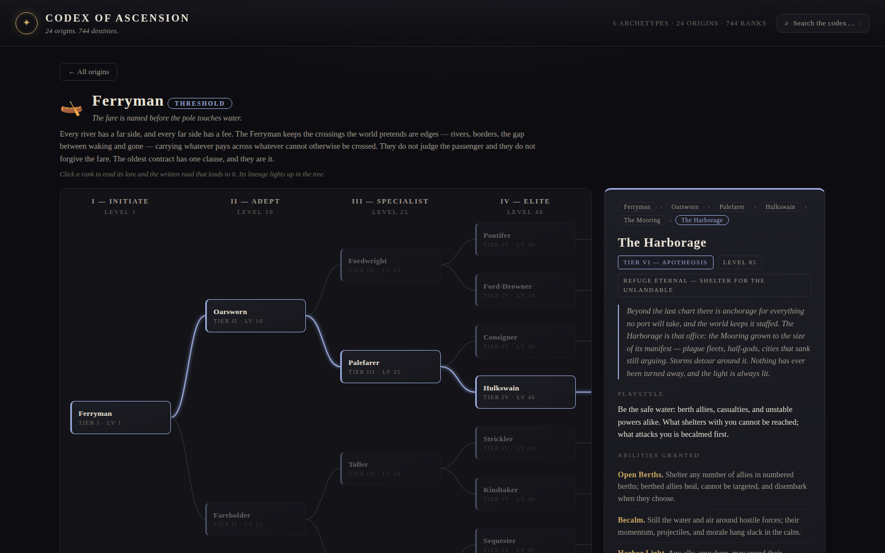

# ✦ Codex of Ascension

An RPG class-progression system with **24 starting classes** ("origins") across **6 archetypes**, each unfolding through **6 tiers of written progression** into 8 diverging apotheoses — **744 ranks** in total — plus an interactive UI to explore it all.



## Viewing the codex

**Live site:** https://rlag1998.github.io/rpg_progression/ (served from the `gh-pages` branch, republished automatically on every push by `.github/workflows/pages.yml`).

Or open **`index.html`** in any browser — it is fully self-contained (no server, no dependencies, works offline). Or read the same content as prose in [`docs/`](docs/README.md), one markdown file per class.

In the UI:

- Pick an origin from the landing page (grouped by archetype).
- Click any rank in the tree to read its lore, abilities, and the **written road** — the in-world steps required to attain it. The rank's lineage lights up in the tree.
- Use **“Trace the full road”** to read every step from Initiate to that rank, end to end.
- Press <kbd>/</kbd> to search all 744 ranks by name, role, or class.

## The progression system

Wide at the start, deep at the end. Every origin follows the same five-tier arc, but no two lives read alike:

| Tier | Name | Level | Shape |
|---|---|---|---|
| I | Initiate | 1 | The base class — how the path begins |
| II | Adept | 10 | The first true choice: one of **2 paths** |
| III | Specialist | 25 | Each path splits again: **4 specializations** |
| IV | Elite | 40 | Each specialization houses **two rival elite orders** — irreconcilable philosophies of the same mastery: **8 elites** |
| V | Mythic | 60 | The legendary end-state of each line: **8 mythics** |
| VI | Apotheosis | 85 | Beyond the end — the person and the legend separate, and the world keeps them: **8 apotheoses** |

That's 1 → 2 → 4 → 8 → 8 → 8 = **31 ranks per origin**, forming a strict branching tree. Every rank carries its own lore, role, playstyle, 3–4 named abilities, and 3–5 written progression steps — concrete in-world trials, not just level gates.

## The twenty-four origins

| Archetype | Origins |
|---|---|
| **Might** — steel, sinew, and the refusal to fall | ⚔️ Warrior · 🪓 Berserker · 🛡️ Knight · ⛓️ Gladiator |
| **Cunning** — wits sharp enough to cut where blades cannot | 🗡️ Rogue · 🏹 Ranger · 🎻 Bard · ⚓ Corsair |
| **Arcane** — power studied, inherited, or borrowed at interest | 📖 Wizard · 🐲 Sorcerer · 👁️ Warlock · 🔔 Summoner |
| **Spirit** — faith, nature, and breath made manifest | 🕯️ Cleric · 🌿 Druid · 🧘 Monk · 🪶 Shaman |
| **Esoteric** — the forbidden arts that fit no tradition | 💀 Necromancer · ⚙️ Artificer · 🔮 Spellblade · 🌙 Witch |
| **Threshold** — what waits in the spaces between | 🌀 Dreamwalker · 🕳️ Umbralist · 🎭 Masquer · 🛶 Ferryman |

## Repository layout

```text
data/classes.json   ← source of truth: all 15 families, 225 ranks
tools/template.html ← UI template (data gets inlined at build time)
tools/build.js      ← validates the data, builds index.html and docs/
index.html          ← the interactive codex (generated, committed for convenience)
docs/               ← the written progression as markdown (generated)
```

## Editing the content

1. Edit `data/classes.json`. Each family must keep the fixed topology (`t1`, `t2a/b`, `t3a–d`, `t4a–h`, `t5a–h`, `t6a–h` with tiers 1–6 at levels 1/10/25/40/60/85; `t4a`/`t4e` are the rival elite orders of `t3a`, and tiers 5–6 continue each elite line by letter) — the build validates this and fails loudly on drift.
2. Rebuild:

   ```sh
   node tools/build.js
   ```

   This regenerates `index.html` and `docs/` from the data. Never edit those outputs by hand.
